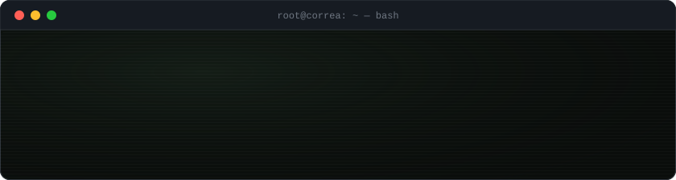

```text
root@correa:~# cat experiencia.log
lead software engineer ........ suporte de domingo
lead software engineer ........ punch control
professor de tecnologia ....... senai · 4 anos
professor de tecnologia ....... senac · 2 anos
mestrado ...................... computação aplicada · ipt

root@correa:~# ./ensinar --stats
alunos ........................ +1000
instituições .................. senai · senac
conteúdo ...................... @professorcorrea

root@correa:~# ls ~/projetos
suporte-de-domingo/   code-trouble/   punch-control/

root@correa:~# cat stack.txt
javascript  typescript  python  ui/ux  acessibilidade  clean code

root@correa:~# ./contato
```

[linkedin](https://www.linkedin.com/in/lucascorreaa/) · [suporte de domingo](https://suportededomingo.com.br/) · [instagram](https://www.instagram.com/professorcorrea)

<sub>educar é tornar o saber algo com voz, sentido e sentimento.</sub>
