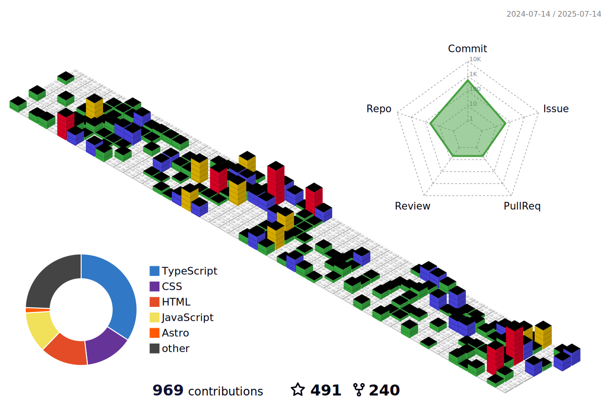

<h1 align="center">Lucas Corrêa</h1>

  Desenvolvedor Full Stack · Professor de TI · Especialista em Produto Digital

---

---

## Sobre

- Atuação em desenvolvimento full stack com JavaScript e TypeScript
- Professor de Tecnologia no SENAI e SENAC; criador do canal Professor Corrêa
- Especialista em acessibilidade, UI/UX, clean code e liderança de produtos digitais
- Pós-graduação em Engenharia de Software e Digital Product Leadership
- Experiência em automação de processos e integração de sistemas utilizando Python

## Projetos em destaque

- [Toque AI](https://toqueai.com.br/) – Plataforma de QR Code para identificação e gestão de pets, pessoas e objetos
- [Suporte de Domingo](https://suportededomingo.com.br/) – Soluções digitais e agendamento personalizado
- [Code Trouble](https://codetrouble.com.br) – Comunidade aberta para desenvolvedores e troca de conhecimento

## Contato

- [LinkedIn](https://www.linkedin.com/in/lucascorreaa/)
- [Suporte de Domingo](https://suportededomingo.com.br/)
- [Portfólio](https://professorcorrea.com.br/)
- [Instagram - Professor Corrêa](https://www.instagram.com/professorcorrea)

---

> Educar é tornar o saber algo com voz, sentido e sentimento.
